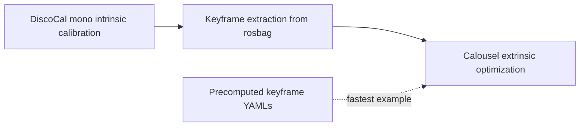

# Calousel

**Extrinsic Calibration of Non-overlapping Multi-camera Systems from Pure Rotation**

Calousel calibrates non-overlapping multi-camera systems by rotating the camera rig on a turntable while a single calibration board remains static. It combines per-camera board observations from [DiscoCal](https://github.com/chaehyeonsong/discocal), keyframe extraction from ROS 2 bags, and turntable-aware SE(3) optimization through a latent turntable frame.

This repository contains the research code for our IROS 2026 paper:

> **Calousel: Extrinsic Calibration of Non-overlapping Multi-camera Systems from Pure Rotation**

[Paper](#) | [Video]((https://www.youtube.com/watch?v=mcNS33hJPzg)) | [BibTeX](#citation)

<p align="center">
  
</p>

<p>
  
  
  
  
</p>

## Contents

- [Calousel](#calousel)
  - [Contents](#contents)
  - [Overview](#overview)
  - [Installation](#installation)
    - [Option 1) Build with Docker](#option-1-build-with-docker)
    - [Option 2) Naive build](#option-2-naive-build)
  - [Run The Examples](#run-the-examples)
    - [Fast Smoke Test](#fast-smoke-test)
    - [Full Testbed Example](#full-testbed-example)
    - [One-Shot Pipeline](#one-shot-pipeline)
  - [Command Reference](#command-reference)
  - [Configuration](#configuration)
    - [DiscoCal Intrinsic YAML](#discocal-intrinsic-yaml)
    - [Calousel YAML](#calousel-yaml)
  - [Citation](#citation)
  - [License](#license)
  - [Acknowledgements](#acknowledgements)

## Overview

| Package | Role |
| --- | --- |
| `src/discocal` | Forked DiscoCal submodule for intrinsic calibration and board pose extraction. |
| `src/calousel` | Keyframe extraction, turntable-based extrinsic optimization, and pipeline CLI. |
| `src/camera_image_saver` | Auxiliary ROS 2 tool for saving images from a topic. |
| `examples` | Testbed configs, calibration images, precomputed intrinsics/keyframes, scripts, and evaluation code. |

The paper evaluates both a controlled camera-rig testbed and a full-scale vehicle platform. This public release ships a compact controlled-testbed example with two samples, `testbed_A` and `testbed_B`. The raw rosbags are not tracked in git, but precomputed keyframes are included so the fastest example can run without downloading any bag files.

Calousel is organized as a three-stage workflow:



| Stage | Purpose | Main config | Output |
| --- | --- | --- | --- |
| 1. Intrinsics | Estimate per-camera intrinsics with DiscoCal. | `examples/configs/discocal/discocal_cam*.yaml` | `intrinsic_parameters.yaml` |
| 2. Keyframes | Extract selected board poses from rosbags. | `examples/configs/calousel/calousel_testbed_*.yaml` | `cam*/keyframe_data.yaml` |
| 3. Extrinsics | Optimize camera extrinsics with Calousel. | `examples/configs/calousel/calousel_testbed_*.yaml` | `extrinsic_calibration_data.yaml` |

## Installation

### Option 1) Build with Docker

Docker is the recommended way to run the release. The image builds the complete ROS 2 Humble workspace and installs Ceres 2.2.0 from source.

```bash
git clone --recurse-submodules https://github.com/Isornorphism/rotating_plate_calibration.git
cd rotating_plate_calibration

docker build -t calousel:latest .
docker run --rm -it \
  -v "$PWD/examples:/workspace/examples" \
  calousel:latest
```

Edits under `examples/` are reflected immediately when mounted as above; C++ source changes require rebuilding the image.

### Option 2) Naive build

Native build is also possible on Ubuntu 22.04 with ROS 2 Humble, Ceres Solver 2.2.0 or newer, OpenCV, Eigen3, yaml-cpp, Sophus, and the Python packages `numpy`, `PyYAML`, `scipy`, `matplotlib`, and `opencv-python` or their apt equivalents.

```bash
git submodule update --init --recursive
source /opt/ros/humble/setup.bash

colcon build --symlink-install \
  --packages-select discocal calousel camera_image_saver

source install/setup.bash
```

## Run The Examples

### Fast Smoke Test

This path uses the included intrinsic and keyframe YAML files. It does not require raw rosbags.

```bash
examples/scripts/run_optimize_extrinsics_examples.sh
python3 examples/scripts/evaluate_testbed_results.py
```

A typical run reports sub-degree rotational error and millimeter-level translation displacement error for `testbed_A` and `testbed_B`.

### Full Testbed Example

To regenerate every intermediate result, run DiscoCal, download the two testbed rosbags, extract keyframes, and then optimize extrinsics.

```bash
examples/scripts/run_discocal_examples.sh
```

Download the sample rosbags here: [Sample rosbags](#)

Place the downloaded rosbags at:

```text
examples/data/rosbag/testbed_A.bag/
examples/data/rosbag/testbed_B.bag/
```

Each bag directory should contain `metadata.yaml` and its sqlite3 database file.
Then run:

```bash
examples/scripts/run_keyframe_extract_examples.sh
examples/scripts/run_optimize_extrinsics_examples.sh
python3 examples/scripts/evaluate_testbed_results.py
```

The keyframe extraction step decodes every image frame in the bag, so it is the
slowest part of the example workflow.

### One-Shot Pipeline

After the rosbags are available, Stage 2 and Stage 3 can be run together:

```bash
examples/scripts/run_calousel_pipeline_examples.sh
python3 examples/scripts/evaluate_testbed_results.py
```

## Command Reference

Stage 1 uses the DiscoCal YAML as a positional argument:

```bash
ros2 run discocal run_mono.py examples/configs/discocal/discocal_cam0.yaml
```

Stage 2 passes the Calousel YAML through `--config`:

```bash
ros2 run calousel keyframe_extractor_cli --config examples/configs/calousel/calousel_testbed_a.yaml
```

Stage 3 uses the same Calousel YAML:

```bash
ros2 run calousel optimize_extrinsics_cli --config examples/configs/calousel/calousel_testbed_a.yaml
```

Stage 2 and Stage 3 can also be run in one pass:

```bash
ros2 run calousel calousel_pipeline --config examples/configs/calousel/calousel_testbed_a.yaml
```

Auxiliary tool: `camera_image_saver` is useful for capturing images from a live topic or a replayed rosbag.

```bash
ros2 run camera_image_saver image_saver_node --ros-args \
  -p topic_name:=/cam_0/image_raw \
  -p save_directory:=captured_images
```

## Configuration

### DiscoCal Intrinsic YAML

Example files:

```text
examples/configs/discocal/discocal_cam0.yaml
examples/configs/discocal/discocal_cam1.yaml
```

Important fields:

| Field | Meaning |
| --- | --- |
| `camera.img_dir` | Calibration image directory for one camera. |
| `camera.n_x`, `camera.n_y` | Circular target grid dimensions. |
| `camera.radius`, `camera.distance` | Target circle radius and spacing in meters. |
| `options.results_path` | Output directory. If omitted, DiscoCal writes `calibration_results/` under `camera.img_dir`. |
| `options.evaluation` | Enables uncertainty outputs such as `unc_map.tif` and `calibration_uncertainty.png`. |

### Calousel YAML

Example files:

```text
examples/configs/calousel/calousel_testbed_a.yaml
examples/configs/calousel/calousel_testbed_b.yaml
```

The same Calousel YAML is used by keyframe extraction, extrinsic optimization,
and the one-shot pipeline.

Important fields:

| Field | Meaning |
| --- | --- |
| `bag_path` | Rosbag directory or sqlite3 bag path. |
| `keyframe_result_dir` | Output directory for keyframes; input directory for optimization. |
| `extrinsic_result_dir` | Output directory for extrinsic calibration results. |
| `camera.camN.topic` | ROS image topic for camera `N`. |
| `camera.camN.intrinsic_yaml` | DiscoCal `intrinsic_parameters.yaml` for camera `N`. |
| `camera.camN.frame_window_size` | Number of frames considered in each selection window. |
| `camera.camN.angle_threshold` | Minimum rotation threshold in degrees for advancing windows. |
| `camera.camN.rolling_shutter_compensation` | Enables rolling-shutter compensation during pose extraction. |
| `board.*` | Calibration board geometry. |
| `use_weight` | Uses the diagonal of the covariance-derived information matrix as residual weights. |
| `fix_reference_camera_z_to_zero` | Fixes the reference camera z coordinate along the turntable-axis direction to remove axial ambiguity. |
| `optimize_reprojection_error` | Uses the reprojection-error objective instead of the default 3D motion objective. |


## Citation

If you use this code, please cite the Calousel paper. The final BibTeX entry
will be updated after the official proceedings information is available.

```bibtex
@inproceedings{calousel2026,
  title = {Calousel: Extrinsic Calibration of Non-overlapping Multi-camera Systems from Pure Rotation},
  booktitle = {IEEE/RSJ International Conference on Intelligent Robots and Systems (IROS)},
  year = {2026}
}
```

## License

<a rel="license" href="http://creativecommons.org/licenses/by-nc-sa/4.0/"></a><br />
This work is licensed under a [Creative Commons Attribution-NonCommercial-ShareAlike 4.0 International License](http://creativecommons.org/licenses/by-nc-sa/4.0/).

- This work is protected by a patent.

- All codes on this page are copyrighted by Seoul National University and published under the Creative Commons Attribution-NonCommercial-ShareAlike 4.0 License. You must attribute the work in the manner specified by the author. You may not use the work for commercial purposes, and you may only distribute the resulting work under the same license if you alter, transform, or create the work.

- For commercial purposes, please contact [skh8464@snu.ac.kr](mailto:skh8464@snu.ac.kr).

## Acknowledgements

This project builds on [DiscoCal](https://github.com/chaehyeonsong/discocal) for accurate circular-pattern intrinsic calibration and board pose extraction. Please cite DiscoCal as appropriate if you use the intrinsic calibration component.
